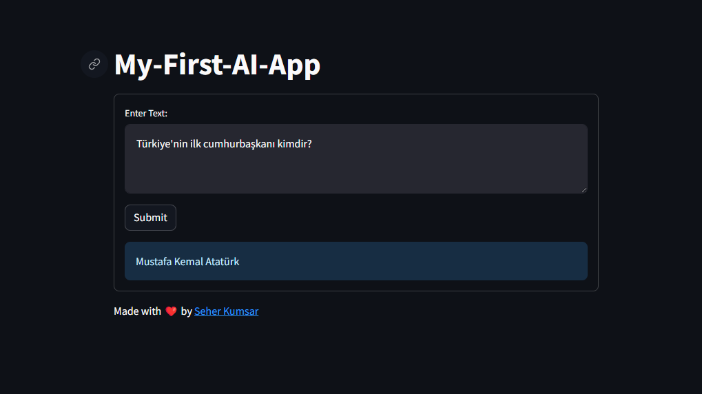

# OpenAI Streamlit Project



This is a simple Streamlit web application that uses OpenAI's language model to generate responses based on user input. The app allows users to enter text, and the OpenAI model will generate a response.

## Getting Started

Python version: 3.9

Make sure you have the required dependencies installed:

```bash
pip install -r requirements.txt
```

### Running the App

Run the Streamlit app using the following command:
```bash
streamlit run streamlit_app.py
```

### Usage

1. Enter your OpenAI API Key in the sidebar.
2. Input text in the main body text area.
3. Click the "Submit" button to generate a response.

### Configuration

You need to provide your OpenAI API Key to use the language model. Enter the API Key in the sidebar before submitting.

## Live Demo

Check out the live demo of the OpenAI Streamlit Project [here](https://openai-app-project.streamlit.app/).


## License

This project is licensed under the [MIT License](LICENSE).